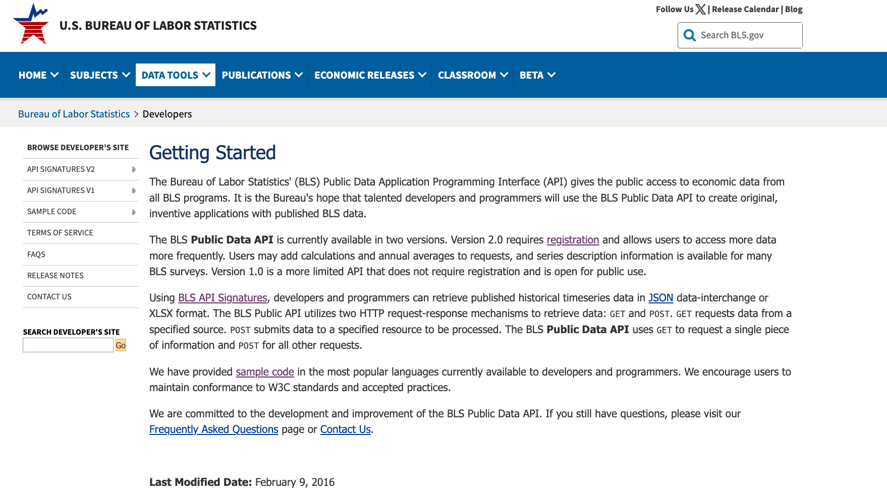
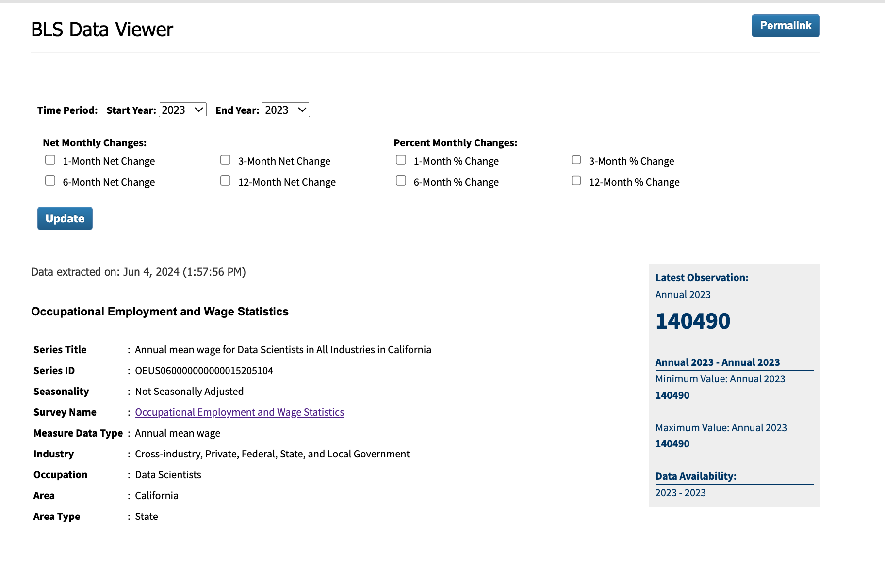
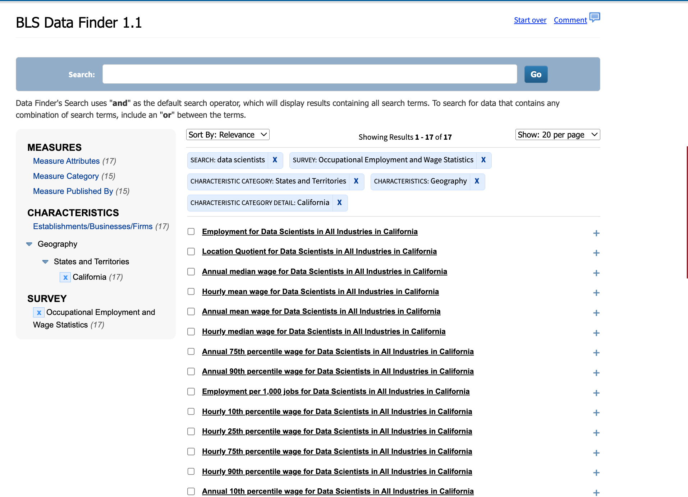
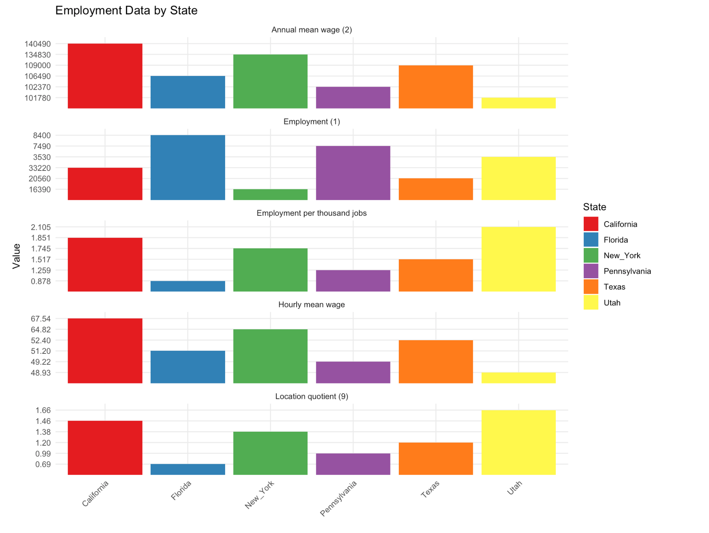
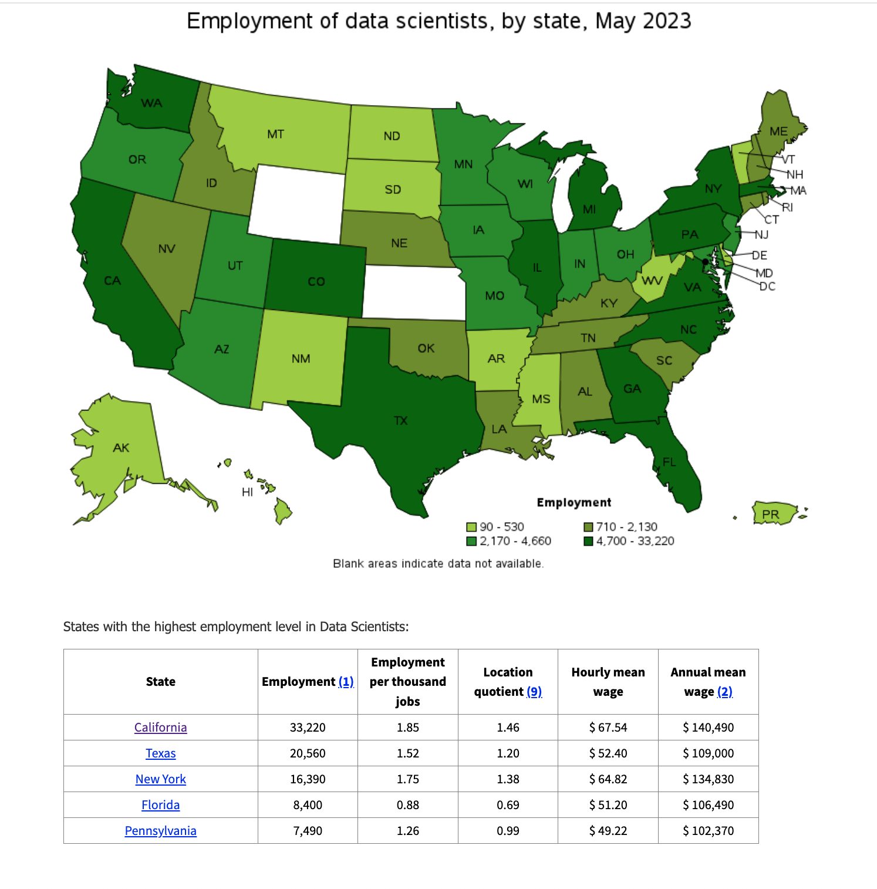

# Data Science Labor Statistics

This project leverages the U.S. Bureau of Labor Statistics Public API to fetch and analyze employment data across various occupations in the United States. Designed for versatility, the codebase can be easily customized to gather and visualize employment statistics for any job title, from Data Scientists to Engineers. This tool is invaluable for policymakers, economists, job seekers, and researchers interested in understanding employment trends and wage estimates across different sectors and regions. By providing insights into occupational employment, this project aids in strategic planning, educational guidance, and economic forecasts.

## Getting Started

These instructions will get you a copy of the project up and running on your local machine for development and testing purposes.

## Using the Public API from the U.S. Bureau of Labor Statistics

This section guides you through obtaining an API key necessary to fetch data for this project.

### Step 1: Register for an API Key

To access the U.S. Bureau of Labor Statistics Public API, you need to register for an API key. Here is a brief guide on how to do it:

1. Go to [BLS Public Data API](https://www.bls.gov/developers/) website.
2. Follow the registration process to obtain your API key.



For a detailed guide, you can watch this helpful video:

[](https://www.youtube.com/watch?v=118FyvU6OSc)

### Step 2: Using the API Key

Once you have your API key, you can use it to make requests to the API as shown in the example codes in the repository.



### Finding Data Series IDs

To fetch specific data, such as employment statistics for Data Scientists, you need the correct series ID. Use the BLS Data Finder to locate these IDs:



## Understanding the Code

This section explains the purpose and function of the code in the Quarto (.qmd) file included in this repository.

### Overview

The code fetches employment data by state from the U.S. Bureau of Labor Statistics and visualizes this data using `ggplot2` and `plotly` in R.

### Key Functions

- `get_state_data()`: This function retrieves data for a specific state using the BLS API.
- Visualization: The code generates bar graphs representing employment data, which are interactive and can be used for detailed analysis.




### Map from their website



## Customizing the Code for Different Job Titles

### Overview

The code provided in this repository is initially configured to fetch and analyze employment data for a specific occupation but can be easily adapted to gather data for other occupations. This flexibility allows users to explore employment trends across various professions in the U.S.

### Example: Fetching Data for Data Scientists

To tailor the code for fetching employment data for Data Scientists, you will need to modify the `seriesid` used in the API request to correspond to the series ID for Data Scientists. You can find the appropriate series ID by visiting the [Occupational Employment Statistics](https://www.bls.gov/oes/) page on the BLS website.

1. Locate the series ID for Data Scientists or any other occupation by navigating through the BLS's tables or using their search function.
2. Replace the `seriesid` in the `get_state_data()` function with the series ID of the desired occupation.

```r
# Example of modified function call for Data Scientists
seriesid_list <- c("specific_series_id_for_data_scientists")
state_name <- "Your_State"
api_key <- 'YOUR_API_KEY_HERE'
url <- 'https://api.bls.gov/publicAPI/v2/timeseries/data/'

data_scientists_df <- get_state_data(seriesid_list, state_name, api_key, url)
```
3. Run the code to fetch and visualize the employment data for Data Scientists.
This approach can be applied to any occupation by changing the seriesid to match the occupation's specific identifier provided by the BLS.
